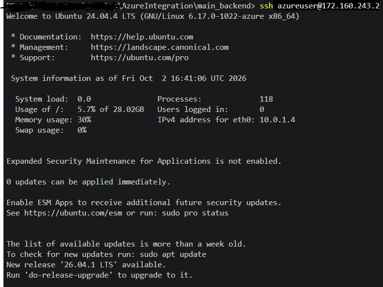
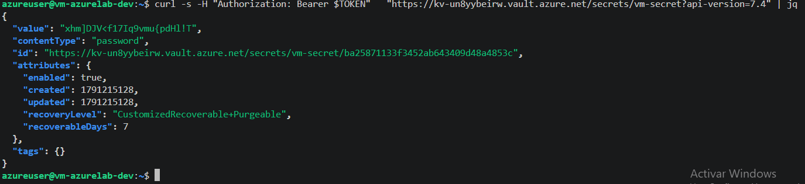

# AzureIntegration
Important notes taken while building the local state, that is, the infrastructure that will store the state of the rest of the project. A local state for the infra that stores the cloud state. As i have started to know everything in Azure is a resource, so we have to create a Resource Group to create the resources, then we have to create the S3 bucket of Azure which is the Blob Storage(Container), this Blob Storage is inside a Storage Account, which is the way of Azure of grouping all the data storage services. 
We can say the hierarqhy is this way -> subscription -> resource group -> storage account -> blob storage
The blob storage is defined by containers 

Needed elements: resource_group, storage_account and storage_container. The storage_account depends on the resource_group and the container depends on the storage_account. To make sure they are always created in the right order, you have to reference them with the nomenclature "type.definedResourceName.variable" in the variable that has the dependency.

Always "terraform init" -> "terraform validate" -> "terraform plan" -> check what is going to be created and lastly -> "terraform apply".

If any resource has been correctly created during the apply but the creation of the config hasnt been complete, you can check with "terraform state list" what has been created and what not. Then "terraform destroy" to eliminate those resources

In new accounts for Azure, sometimes theres a problem with the Regions you can acces to. For example i used West Europe and didnt let me create some resources there. That is why i changed it to Spain Central. The current configuration uses North Europe.

After `terraform apply`, run `terraform output backend_config` to get the `backend "azurerm"` block for the main project.

Im encounting this problem where the Storage Account is trying to be created but the resource_group cant me access for some reason. Then this resource is being taged as *tainted*, whis means is corrupted for terraform, so the next time you want to apply it is going to be recreated -> destroyed and created.

To make this work, i added a fixed waiting time so all the resources are created correctly before any other one that depends on them are created.
To define a *backend* for azure there are 4 ways of doing it(as it states in the official documentation):
- Microsoft Entra ID (Recommended)
- SAS Token (Not recommended for new workloads)
- Access Key (Not recommended for new workloads)
- Access Key Lookup (Not recommended for new workloads)

As recommended we are going to use the first one. To make it work we have to grant the user that we are using the role of "Storage Blob Data Contributor", besides being the owner we need the rol to access the Blob Storage inside the Storage Account. For that we define a role assingment in the definition of the *azure_backend*, we take the id of the account being used to assing the role.

The next step is to build the code to deploy a VM in azure. After creating the enviroment to contain everything.
To build a VM we need to generate a network and then define all the properties needed for creating a VM. Because is something I may use in other projects and is a standar in Terraform, im going to build two *Modules* for this two steps. For any new terraform user, modules are the way of building and abstract declaration of an element.
In this case we can define a module of a VM, that we may use in different projects, then create another one for the network.

A module works like a function. The variables are the parameters, the resources are the body and the outputs are what it returns. The *main_backend* is the one that calls the modules, which are in the *modules* folder (network and vm). The order of the .tf files doesnt matter, terraform reads all of them at the same time and decides the order with the dependencies.

The network module has the VNet, the subnet, the NSG(which is the firewall) and the association of the NSG to the subnet. The NSG only lets in SSH from my IP, everything else is blocked by default by Azure. To avoid opening SSH to everyone, the variable of the IP has a validation that doesnt let you use 0.0.0.0/0. This was a recommendation from the official documentation.

The vm module has the public IP, the NIC and the Ubuntu VM, that you can only access with the SSH key, not with password. It also has an automatic shutdown every day at 23:00 so it doesnt keep spending money if i forget to turn it off. For this one we need to register "Microsoft.DevTestLab" in the provider.

When i tried to check the VM sizes with "az vm list-skus" i got an SSL certificate error. The problem is the AVG antivirus, that intercepts the HTTPS traffic.

To see what VMs are available in this region, with the command *az vm list-skus --location northeurope --resource-type virtualMachines* you get all the available machines in the northeourope region, then i have to filter all the content to select which can i use. My subscription doesnt allow to use all the sizes for the VM that exists

The VM size i wanted to use (Standard_B2ats_v2) appeared as "NotAvailableForSubscription" in northeurope, 
the same kind of problem as with the regions. Listing the sizes with 2 vCPUs or less that are not restricted,
only the F, DC and EC families were available. So after consulting the IA it taught me that the DC and EC are confidential VMs, that need special images and configuration, so i chose Standard_F1s

I had destroyed the azure_backend, so i had to apply it again. The Storage Account has a random name, so the new one was different and i had to change it in *backend.hcl*. Then "terraform init -reconfigure -backend-config=backend.hcl", the -reconfigure is needed because the backend changed.

To deploy it: put your IP with /32 in terraform.tfvars -> check the VM size is available with "az vm list-skus" -> "terraform init" -> "terraform validate" -> "terraform plan" -> "terraform apply" -> "terraform output ssh_command" to connect.

After doing the *terraform apply* it creates 7 resources and then shows the next *Error* 'SkuNotAvailable: The requested VM size for resource 'Following SKUs have failed for Capacity Restrictions: Standard_F1s' is currently not available in location 'northeurope'.
This means it is not available to create another instance of this machine in the specified region. After checking, it means is not actualy available for my type of subscription not in general

After listing all the regions in europe, it looks that Sweden Central is the only one that the free subscription doesnt have limits. I used a Standard_B2ats_v2 size machine.
Connecting to the machine by *ssh azureuser@VMsIPAdress", because we have created a public ed25519 key that has been copied in the VM. We can be authenticated from our local host to the VM and connect directly.

So the next step is trying to give a secret to the VM in a secure way. The idea is that Terraform generates a random password, saves it in a *Key Vault*, and the VM can read it without that password passing through my code. 

The Key Vault is created with *rbac_authorization_enabled = true*. At first i copied the example from the documentation, which uses *access policies*, but that is the old way of giving permissions. With RBAC the permissions are given with roles, the same system as the rest of Azure, so it is all in one place. The name of the Key Vault is global in all Azure and can have max 24 characters, so like the Storage Account i used a *random_string* for the name.

Then i need permissions for myself. It is the same thing that happened with the Storage Account, being the Owner doesnt let you create secrets inside the Key Vault. So i give myself the role "Key Vault Secrets Officer" over the Key Vault. RBAC takes some time to propagate, so if the secret is created right after the role it fails with a 403. To fix it i added a *time_sleep* of 90s.

The password is generated with *random_password* and saved with *azurerm_key_vault_secret*. My first try was using the same *random_string* for the name of the Key Vault and for the password, thought that the value of the *random_string* was different every time and not the same for everything

Something important about this, the password is also saved in the Terraform state, in plain text. That is why the state has to live in a private Storage Account with Entra ID auth and not in Git. Anyone who can read the state can read the password.

For the VM to read the secret it needs an identity, so i added an *identity* block with type "SystemAssigned" in the VM. This makes Azure create an identity for the VM in Entra ID. The vm module returns its *principal_id* as an output, and in *main_backend* i give it the role "Key Vault Secrets User". I put this role assignment in main_backend and not in the module, so the vm module doesnt need to know anything about the Key Vault and i can still use it in other projects.

The difference between the two roles is the important part. "Secrets Officer" can create, read and delete secrets, that is for me. "Secrets User" can only read them.

After applying everything has build up correctly, to check if everything has gone correctly we have to connect to the VM and then ask for the secret.
After connecting to the machine to ask Key Vault for the secret we have to ask for an authentication token.
For that we have to use the next url:
"http://169.254.169.254/metadata/identity/oauth2/token?api-version=2018-02-01&resource=https%3A%2F%2Fvault.azure.net"
I dint know but that IP is an IP that is exposed locally to all the VMs so they can ask for their identity. It is called IMS(Instance Metada Service), with the parameter resource *https%3A%2F%2Fvault.azure.net* we are indicating for what service we need that token

With that token in hand we can call the Key Vault with his name, because its unique and the secret, and we receive the next value:

